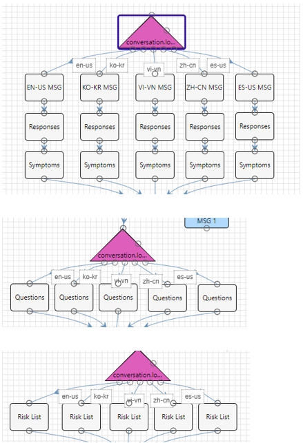
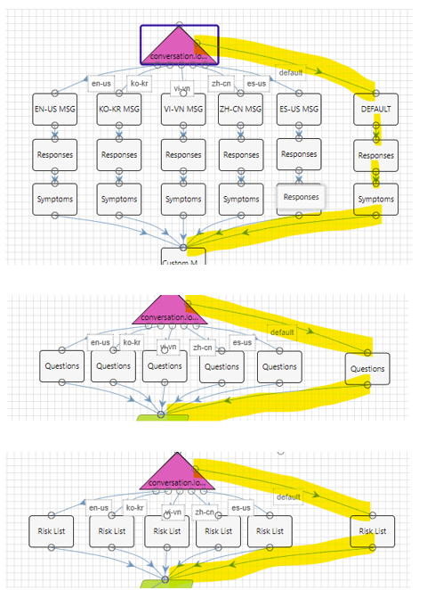
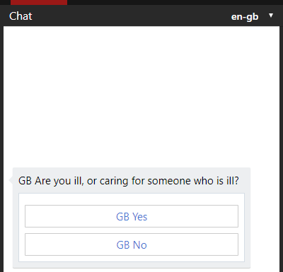

# Localize CDC Triage Template Scenario

The COVID-19 Triage template is aligned with [CDC open source](https://github.com/CDCgov/covid19healthbot), and as a result the localization is done in a switch within the scenario itself rather than using the HealthBot built-in localization. This means that customers willing to introduce a new locale should apply their specific localization as part of the same switch.

**Note:** customer should take into account that changes will overwrite these modification, and he will need to repeat the listed steps after applying any future update of the CDC-CORE protocol.

**The strings in this tutorial are alinged with COVID-19 Traige template version of 6th April 2020.**

## How to apply a new language withing the template CORE scenario
In this tutorial we will walk you through 3 steps to apply a new language to the COVID-19 - CORE PROTOCOL scenario, using the HealthBot built-in localization. In this sample we will add the British English (en-gb) locale.

In this tutorial we explain how to localize the strings in COVID-19 - CORE PROTOCOL scenario. Same method can be used to localize the COVID-19 - CDC WRAPPER scenario.

### Step 1: Add the Default locale Action blocks
All the string in the COVID-19 - CORE PROTOCOL scenario are pre-defined in a dedicated Action blocks, with a set per pre-delivered languages: American English (en-us), Korean (ko-kr), Vietnamese (vi-vn), Chinese Simplified (zh-cn) and Spanish-US (es-us).
A switch statement routes to the selected set of hard-coded strings per language, as you can see in the snapshots:

Edit the COVID-19 - CORE PROTOCOL scenario, add the marked Action blocks, and link them to the Switch default route:

### Step 2: Edit the Default locae Action blocks
Now we want to initialize the scenario strings using the built-in HealthBot localization, rather than hard-coded values. For that we will use the function session.getCustomLocalizedValue with a new set of string IDs. 

Edit each Action blocks and copy into it the content from the corresponding json file from [Actions](./Actions) folder.

### Step 3: Add the language resources in the Built-in 
Last step would be to create strings with the IDs of step #2. This can be done either manually, or by [importing excel](https://docs.microsoft.com/en-us/HealthBot/localization#import-logic) with the full set of IDs.

Switch to the Custom Scenario Localization page (language->Localization), and import the [core_protocol_strings](./core_protocol_strings.xlsx) excel file localized for British English (en-gb). 
To enable other languages edit the excel file, add column per requested language and re-import it.

## Outcome
Now you can go back to the scenartio and run it with en-gb locale.
If all worked well you should see the following localized question:

